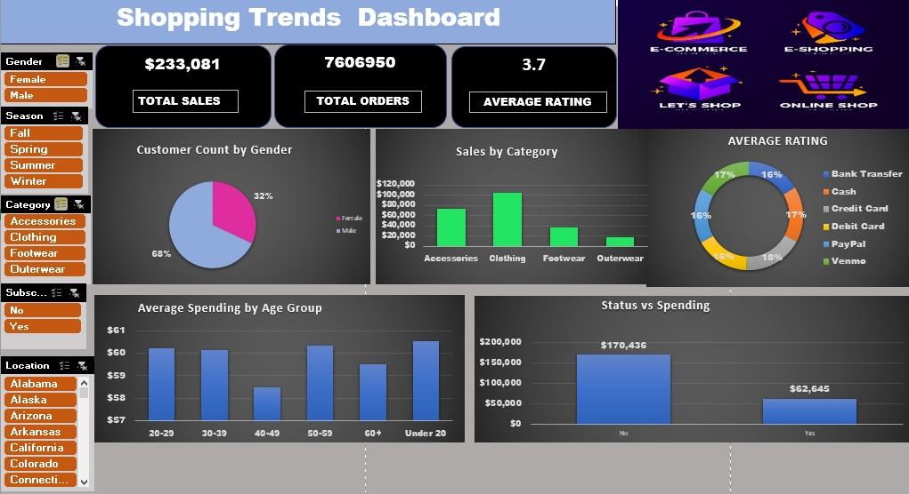

# 🛍️ Shopping Trends Analysis (EDA + Excel Dashboard)

This project analyzes a Shopping Trends dataset using Python for EDA (Exploratory Data Analysis) and presents insights through a clean, interactive Excel Dashboard.

---

## 📊 Dashboard Preview



---

## 📌 Project Goals

- Clean and process raw dataset  
- Perform Exploratory Data Analysis  
- Identify patterns in purchase behavior  
- Build interactive dashboard for insights  

---

## 📂 Repository Contents

| File/Folder | Purpose |
|------------|---------|
| `data/` | Raw dataset used in the analysis |
| `notebook/` | Jupyter Notebook with full EDA |
| `dashboard/` | Final Excel dashboard image |
| `requirements.txt` | Required Python libraries |

---

## 🔍 Key Findings

- Majority of buyers are **female (68%)**
- **Clothing category** generates the highest sales
- **Credit Card & Cash** are most used payment methods
- Customers aged **20–29** spend the most overall
- Average satisfaction rating is **3.7/5**

---

## 🛠 Tools Used

- Python (Pandas, NumPy, Matplotlib, Seaborn)
- Jupyter Notebook
- Microsoft Excel (Pivot Tables, Slicers, KPI Cards)

---

## 🚀 Run Instructions

Clone the repo:

```bash
git clone https://github.com/YOUR-USERNAME/Shopping-Trends-Analysis.git
